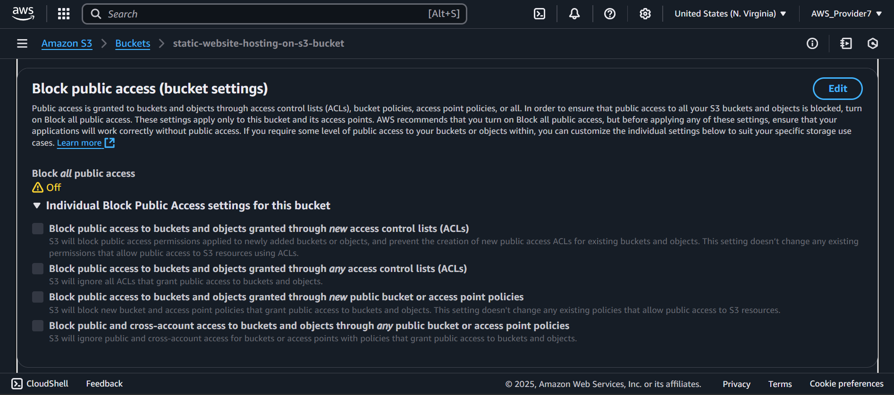

# Static Website Hosting on AWS S3

## 🚀 Project Overview
This project demonstrates how to host a **static website** using **Amazon S3**. The website consists of an `index.html` and an `error.html` file and is accessible through a public **S3 bucket website endpoint**.

## 🎯 Purpose
The goal of this project is to showcase my ability to configure AWS S3 for static website hosting, set appropriate permissions, and ensure reliable website accessibility. This setup is ideal for hosting portfolios, documentation, and other static web pages.

## 🔗 Live Website URL
**Copy the link below to your browser to View the Hosted Website**

`http://static-website-hosting-on-s3-bucket.s3-website-us-east-1.amazonaws.com/`

---

## 🛠️ Steps to Set Up Static Website Hosting on S3
### 1️⃣ Create an S3 Bucket
1. Go to **AWS Console** → **S3** → Click **Create Bucket**.
2. Name the bucket: `static-website-hosting-on-s3-bucket`.
3. Select **Region** (e.g., `us-east-1`).
4. **Disable Block Public Access** (uncheck all options and confirm).
5. Enable **Static Website Hosting** in the **Properties** tab.
6. Set **index document** as `index.html` and **error document** as `error.html`.
7. Click **Create Bucket**.

### 2️⃣ Upload Website Files
1. Open the S3 bucket.
2. Click **Upload** → Add `index.html` and `error.html`.
3. Click **Upload**.

### 3️⃣ Set Bucket Permissions
#### Update the **Bucket Policy** (Permissions → Bucket Policy)
Paste the following JSON code and replace `<your-bucket-name>`:
```json
{
    "Version": "2012-10-17",
    "Statement": [
        {
            "Sid": "PublicReadGetObject",
            "Effect": "Allow",
            "Principal": "*",
            "Action": "s3:GetObject",
            "Resource": "arn:aws:s3:::static-website-hosting-on-s3-bucket/*"
        }
    ]
}
```

### 4️⃣ Retrieve the Website URL
1. Go to **S3 Bucket** → **Properties**.
2. Scroll down to **Static Website Hosting**.
3. Copy the **Bucket Website Endpoint**.
4. Paste it into your browser to test the website.

---

## ✅ Key Features
✔ **Simple and Cost-Effective Hosting** under AWS Free Tier  
✔ **No Server Management Required**  
✔ **Publicly Accessible with S3 Bucket Policy**  
✔ **Supports HTML, CSS, and JavaScript**  

---

## 📸 Proof of Work (Screenshots)

### S3 Bucket Static Website Hosting Settings


---
### Uploaded index.html and error.html


---
### Bucket Policy Configuration


---
### Live Website Working in Browser 


---

### Allowing public access



---

## 📌 Future Improvements
- Integrate **CloudFront** for HTTPS and caching optimization.
- Add a **custom domain** using **Route 53**.
- Implement **CI/CD pipeline** for automated deployments.

---

## 🤝 Connect with Me
If you have any questions or feedback, feel free to reach out:
📧 Email: dhwarakesh99@gmail.com
---
💼 LinkedIn: https://www.linkedin.com/in/dhwarakesh-srinivasan-361719292  
---
📂 GitHub: https://github.com/git-hub-user7

---

